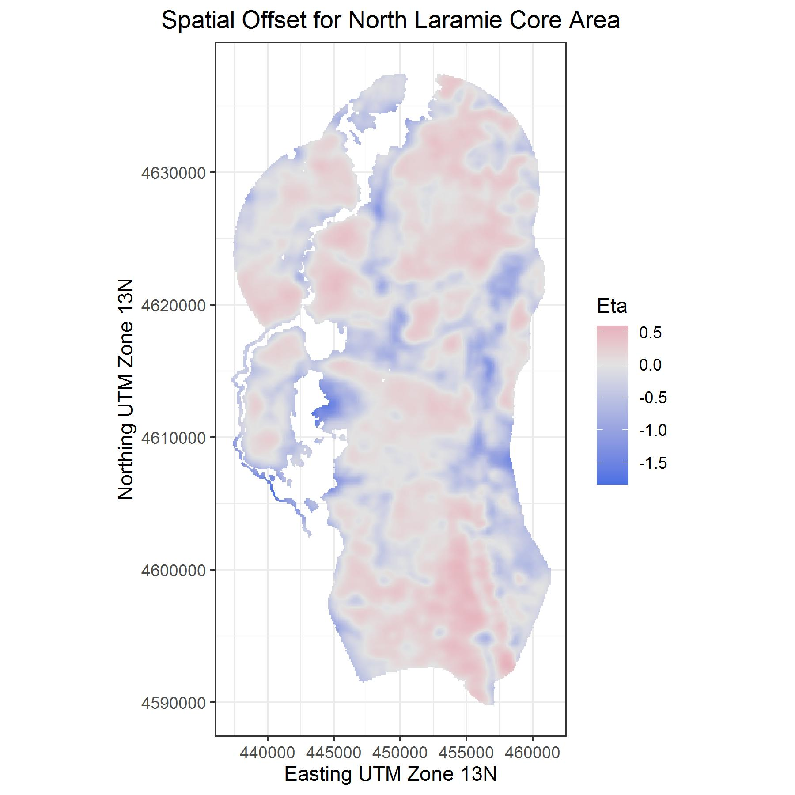
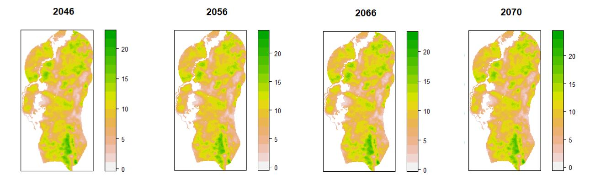

```{r setup, include=FALSE}
knitr::opts_chunk$set(echo = FALSE, message = FALSE, warning = FALSE)
library(tidyverse)
library(readxl)
library(ggrepel)
library(lubridate)
library(scales)
library(knitr)
library(kableExtra)
library(broom)

theme_set(theme_classic(base_size = 10) +
  theme(strip.background = element_blank()))

# load data and results
gcmFile <- "L:\\102 - USGS\\102 - 88 - SageCastWY\\Output\\gcmErrorSummary.xlsx"
gcmFile <- "../Output/gcmErrorSummary.xlsx"
gcmDat <- readxl::read_excel(gcmFile, sheet = 1) %>%
  as.data.frame() %>%
  drop_na()

nameMap <- read.csv("../AuxData/CoreAreaNamesMapping.csv")
```

## Motivation

Goal of the core area strategy:
\medskip

\begin{quote}
  "...to minimize future disturbance by co-locating proposed disturbances within area already disturbed or naturally unsuitable."
\end{quote}

State of Wyoming 2015

## Motivation

Climate change might switch habitat from being "naturally" suitable to unsuitable, or vice versa.

## Approach

1. Fit a dynamic time series model to the Back-In-Time sagebrush data set to quantify the influence of weather/climate on sagebrush cover change.

1. Use the fitted model to project changes into the future, driven by global circulation model projections.

## Data: BIT Time Series

```{r data, fig.width=8.5, fig.height=5}
bit <- readRDS("../Output/historic_Sage_Cover_Summary.RDS")
ggplot(bit, aes(x = year, y = mean)) +
  # geom_ribbon(aes(ymin = mean-sd, ymax = mean+sd), alpha = 0.2, fill = "tan") +
  geom_ribbon(aes(ymin = q025, ymax = q975), alpha = 0.2, fill = "tan") +
  geom_line(size = 2, color = "white") +
  geom_line() +
  facet_wrap(~coreName, scales = "free_y", ncol = 6) +
  theme(axis.text.x = element_text(angle = 90, vjust = 0.5, hjust=1),
        strip.text = element_text(size = 5)) +
  labs(x = "Year", y = "Cover (%)") +
  scale_y_continuous(breaks= scales::pretty_breaks())
```

## Model: dynamic additive spatiotemporal model

$y_{i,t}$ = observed percent cover of cell *i* in year *t*  
$x_{i,t}$ = log cover in year *t-1* and observed climate covariates in cell *i* in year *t*  
$w_{i}$ = observed deviation of cell *i* from the mean percent cover  

\begin{equation}
y_{i,t} \sim \text{Poisson}(\text{exp}(\mu_{i,t}))
\end{equation}


\begin{equation}
\label{eq:regression}
\mu_{i,t} = \bm{\beta} x'_{i,t} + \gamma_{t} + w_{i}
\end{equation}

## Spatial offset ($w_{i}$)

{width=75%}

## Climate covariates

- Average spring-through-summer* precipitation
- Average spring-through-summer temperature

\medskip
\* March 1 through August 31 for each year *t*

## Climate change projections


```{r gcm-reads}
gcmLong <- gcmDat %>%
  dplyr::select(GCM, relErr, relErrTas, relErrPr) %>%
  mutate(relErr = relErr / 2) %>%
  tidyr::pivot_longer(cols = c("relErr", "relErrTas", "relErrPr"),
                      names_to = "errStat",
                      values_to = "error")

errLabs <- c("Combined", "Temperature", "Precipitation")
names(errLabs) <- c("relErr", "relErrTas", "relErrPr")

ranks <- gcmLong %>%
  ggplot() +
  geom_col(aes(reorder(GCM, error), y=error), width = 0.2, fill = "darkblue", color = "darkblue") +
  facet_wrap(~errStat, nrow = 3, scales = "free_y",
             labeller = labeller(errStat = errLabs)) +
  xlab("Global Circulation Model") +
  ylab("Relative error (E*)") +
  scale_y_continuous(limits = c(0,1)) +
  theme(axis.text.x = element_text(angle = 45, vjust = 1, hjust=1)) +
  ggtitle("A")
```


```{r gcm-ranks, fig.width=8.5, fig.height=4.5}
climate <- read.csv("../AuxData/CMIP6_future_by_core.csv") %>%
  filter(coreName == "Greater South Pass 1") %>%
  pivot_longer(cols = c("pr", "tas")) %>%
  mutate(group = paste0(source_id, experiment_id)) %>%
  mutate(name = case_when(name == "pr" ~ "Precipitation (mm)",
                          TRUE ~ "Temperature (deg. C)"))

gcms <- unique(climate$source_id)
gcmWeights <- gcmLong %>%
  filter(GCM %in% gcms) %>%
  filter(errStat == "relErr") %>%
  mutate(weight = 1 - error) %>%
  rename("source_id" = GCM) %>%
  dplyr::select(source_id,  weight)

climateMeans <- climate %>%
  left_join(gcmWeights, by = "source_id") %>% 
  drop_na() %>%
  group_by(year, name, experiment_id) %>%
  mutate(weight = weight / sum(weight)) %>%
  ungroup() %>%
  dplyr::select(source_id, year, experiment_id, name, value, weight) %>%
  mutate(w = value*weight) %>%
  group_by(year, experiment_id, name) %>%
  summarise(WeightedMeanValue = sum(w))


cols <- RColorBrewer::brewer.pal(7, "YlOrRd")[c(3,5,7)]
cols <- c("darkblue", cols)
examp <- ggplot(climate, aes(x = year, y = value)) +
  geom_line(alpha = 0.1, aes(group = group, color = experiment_id)) +
  geom_line(data = climateMeans, aes(x = year, y = WeightedMeanValue, color = experiment_id), size = 1) +
  # stat_smooth(aes(color = experiment_id),
  #             method = "lm", se = FALSE, size = 1) +
  facet_wrap(~name, scales = "free_y", ncol = 1) +
  scale_color_manual(values = cols, name = NULL) +
  labs(x = "Year", y = "Covariate value") +
  theme(legend.position = "bottom") +
  ggtitle("B")

cowplot::plot_grid(ranks, examp, ncol = 2)
```

## Sagebrush cover targets

Average cover across all active nesting and summer habitat at 100m resolution

```{r}
nameMap %>%
  group_by(Region) %>%
  summarise(NestingTarget = paste0(unique(NestingTarget), "%"),
            SummerTarget = paste0(unique(SummerTarget), "%")) %>%
  knitr::kable()
```


## Results: equilibrium cover

```{r equilibrium-cover, fig.width=8.5, fig.height=4.5}
obscover <- read.csv("../Output/historic_Sage_Cover_Summary.csv") %>%
  group_by(coreName) %>%
  summarise(MeanCover = mean(mean)) %>%
  mutate(NameNoSep = gsub(" ", "", coreName)) %>%
  left_join(nameMap)

allpostdirs <- list.files("../Output/MCMC/")
allposts <- tibble()
for(d in allpostdirs) {
  f <- paste0("../Output/MCMC/", d, "/MCMC.RDS")
  if(file.exists(f)) {
    tmp <- readRDS(f)
    cover <- exp(tmp[ , "Beta[1]"] / (1 - tmp[,"Beta[2]"]))
    df <- data.frame(CoreArea = d,
                     Cover = cover)
    allposts <- bind_rows(allposts, df)
  }
}

allposts <- allposts %>%
  rename("NameNoSep" = CoreArea) %>%
  left_join(nameMap)

ggplot(allposts, aes(x = Cover)) +
  geom_density(color = NA, fill = "tan", adjust = 2) +
  geom_vline(data = obscover, aes(xintercept = MeanCover)) +
  facet_wrap(~Abbreviation, scales = "free") +
  labs(x = "Average equilibrium cover (%)", y = NULL) +
  theme(axis.line.y = element_blank(),
        axis.text.y = element_blank(),
        axis.ticks.y = element_blank()) +
  scale_x_continuous(breaks = scales::pretty_breaks(3))
```


## Results: Climate sensitivity

```{r create-summaries}
path <- "../Output/Sensitivities/"
coreAreas <- list.files(path)
sensDf <- tibble()
for(area in coreAreas) {
  tmp <- readRDS(paste0(path, area, "/LogChangeSensitivity.RDS"))
  sensDf <- sensDf %>%
    bind_rows(tmp)
}

sensSummaries <- sensDf %>%
  mutate(Driver = case_when(
    Driver == "Precipitation" ~ "Ppt.",
    Driver == "Temperature" ~ "Temp.",
    TRUE ~ "Both"
  )) %>%
  group_by(CoreName, Driver) %>%
  summarise(Mean = mean(Sensitivity),
            Lower = quantile(Sensitivity, 0.025),
            Upper = quantile(Sensitivity, 0.975),
            Min = min(Sensitivity),
            Max = max(Sensitivity),
            .groups = "drop")

ciWidths <- sensSummaries %>%
  filter(Driver != "Both") %>%
  mutate(Width = Upper - Lower) %>%
  group_by(Driver) %>%
  summarise(MeanWidth = round(mean(Width), 3))
```

```{r sensitivities, fig.height = 5.5, fig.width=8.5} 

pal <- RColorBrewer::brewer.pal(7, name = "BrBG")
pal[4] <- "grey80" 
scale_color_fermenter_custom <- function(pal, na.value = "grey50", guide = "coloursteps", aesthetics = "color", ...) {
  binned_scale("color", "fermenter", ggplot2:::binned_pal(scales::manual_pal(unname(pal))), na.value = na.value, guide = guide, ...)  
}

drives <- c("Temp.", "Ppt.")
labs <- c("Temperature", "Precipitation")
plotList <- list()
for(i in 1:length(drives)) {
  ylab <- paste(labs[i], "sensitivity")
  tmp <- sensSummaries %>%
    filter(Driver == drives[i]) %>%
    rename("NameNoSep" = CoreName) %>%
    left_join(nameMap, by = "NameNoSep") %>%
    mutate(CoreName = Abbreviation) %>%
    filter(CoreName != "Sdsk")
    # mutate(CoreName = paste0(Abbreviation, ": ", Name))
  tp <- ggplot(tmp, aes(x = reorder(CoreName, Mean), color = Mean)) +
    geom_hline(aes(yintercept = 0), linetype = 2) +
    geom_errorbar(aes(ymin = Min, ymax= Max), width = 0.3, size = 0.3) +
    geom_errorbar(aes(ymin = Lower, ymax = Upper), width = 0, size = 1) +
    geom_errorbar(aes(ymin = Mean, ymax = Mean), width = 0.6, size = 0.75) +
    # geom_point(aes(y = Mean)) +
    scale_color_fermenter_custom(pal, name = paste0(labs[i],"\nsensitivity"),
                         breaks = seq(-0.25,0.25,by = 0.1),
                         limits = c(-1, 1)) +
  
    # scale_color_fermenter(palette = "BrBG", 
    #                      direction = 1,
    #                      name = paste0(labs[i],"\nsensitivity"),
    #                      breaks = seq(-0.25,0.25,by = 0.1),
    #                      limits = c(-1, 1)) +
    labs(x = NULL, y = ylab) +
    ggtitle(LETTERS[i+2])+
    coord_flip() +
    guides(color = FALSE) +
    theme(axis.text.y = element_text(size = 5))
  plotList[[i]] <- tp
}

maps <- readRDS("../Output/sensitivityPlotList.RDS")

cowplot::plot_grid(maps[[1]], plotList[[1]],  maps[[2]], plotList[[2]],
                   nrow = 2, align = "h", rel_widths = c(1.5, 1, 1.5, 1))

```

## Results: Climate sensitivities

```{r sen-scatter, fig.width=8.5, fig.height=4.5}

senScatter1 <- sensSummaries %>%
  filter(Driver == "Temp.") %>%
  dplyr::select(CoreName, Mean, Lower, Upper) %>%
  rename("y" = Mean,
         "ymin" = Lower,
         "ymax" = Upper)
senScatter2 <- sensSummaries %>%
  filter(Driver == "Ppt.") %>%
  dplyr::select(CoreName, Mean, Lower, Upper) %>%
  rename("x" = Mean,
         "xmin" = Lower,
         "xmax" = Upper)
sensScatter <- left_join(senScatter1, senScatter2) %>%
  mutate(ys = sign(y),
         xs = sign(x)) %>%
  mutate(Quadrant = case_when(ys == 1 & xs == 1 ~ "B",
                              ys == 1 & xs == -1 ~ "A",
                              ys == -1 & xs == 1 ~ "D",
                              ys == -1 & xs == -1 ~ "C")) %>%
  group_by(Quadrant) %>%
  mutate(N = n()) %>%
  mutate(lab = paste0(Quadrant, " (n = ", N, ")")) %>%
  drop_na()

# Add in abbreviations
sensScatter <- sensScatter %>%
  rename("NameNoSep" = CoreName) %>%
  left_join(nameMap, by = "NameNoSep") %>%
  mutate(CoreName = Abbreviation) %>%
  filter(CoreName != "Sdsk")

set.seed(1)
ggplot(data = sensScatter, aes(x = x, y = y)) +
  geom_vline(aes(xintercept = 0), linetype = 2, color = "tan") +
  geom_hline(aes(yintercept = 0), linetype = 2, color = "tan") +
  geom_errorbar(aes(ymin = ymin, ymax = ymax), color = "darkblue") +
  geom_errorbarh(aes(xmin = xmin, xmax = xmax), color = "darkblue") +
  geom_label_repel(aes(label = CoreName), size = 2, label.size = NA, fill = "white", color = "grey60") +
  geom_point(color = "dodgerblue") +
  facet_wrap(~lab, scales = "free") +
  labs(x = "Sensitivity to precipitation", y = "Sensitivity to temperature") +
  theme(strip.text = element_text(angle = 0, hjust = 0, face = "bold"))
```

## Average posterior effects

*Removed Seedskadee

```{r}
mcmcDir <- "../Output/MCMC/"
subDirs <- list.files(mcmcDir)
mcmcList <- list()

paramLabs <- c("Intercept", "Dens. dep.", "Precip.", "Temp.", "Temporal var.")
paramLabs <- factor(paramLabs, levels = paramLabs)
    
for(doArea in subDirs) {
   tmp <- readRDS(paste0(mcmcDir, doArea, "/MCMC.RDS"))
   mcmcList[[doArea]] <- tmp
}

all <- mcmcList
mcmcList[["Seedskadee"]] <- NULL
# mcmcList[["Powder"]] <- NULL

precipList <- lapply(mcmcList, function(x) x[,3])
precipMat <- matrix(unlist(precipList), ncol = length(precipList), byrow = FALSE)
precipPost <- apply(precipMat, 1, mean)

tempList <- lapply(mcmcList, function(x) x[,4])
tempMat <- matrix(unlist(tempList), ncol = length(tempList), byrow = FALSE)
tempPost <- apply(tempMat, 1, mean)

overallPosts <- tibble(
   `(a) Precipitation` = precipPost,
   `(b) Temperature` = tempPost
) %>%
   mutate(Iteration = 1:n()) %>%
   pivot_longer(cols = c("(a) Precipitation", "(b) Temperature"),
                names_to = "Parameter", values_to = "Value")

ggplot(overallPosts, aes(x = Value)) +
   geom_histogram(aes(y = ..density..), fill = "grey35") +
   facet_wrap(~Parameter, scales = "free") +
   labs(x = "Averaged effect size", y = "Averaged posterior density") +
   theme_classic(base_size = 18) +
   theme(strip.text = element_text(angle = 0, hjust = 0, face = "bold"),
         strip.background = element_blank())
```


## Projections of sagebrush cover

{width=100%}

## Projections of sagebrush cover

```{r projections, fig.height=6}

d <- "../Output/ForecastSummaries/"
allfiles <- list.files(d)
summaryFiles <- allfiles[grep("summaries", allfiles)]

forecasts <- tibble()
for(f in summaryFiles) {
  name <- unlist(strsplit(f, "-"))[1]
  scen <- unlist(strsplit(f, "-"))[5]
  scen <- unlist(strsplit(scen, "[.]"))[1]
  tmp <- read.csv(paste0("../Output/ForecastSummaries/", f)) %>%
    # mutate_at(vars(-Year), truncit) %>%
    mutate(CoreArea = name,
           Scenario = scen)
  forecasts <- bind_rows(forecasts, tmp)
}

forecasts <- forecasts %>%
  mutate(CalYear = 2018+Year) %>%
  mutate() %>%
  filter(CalYear <= 2080) %>%
  rename("NameNoSep" = CoreArea) %>%
  left_join(nameMap, by = "NameNoSep") %>%
  filter(Abbreviation != "Sdsk")

timePoints <- forecasts %>%
  filter(CalYear %in% c(2020, 2040, 2060, 2080))

cols <- RColorBrewer::brewer.pal(7, "YlOrRd")[c(3,5,7)]

ggplot(forecasts, aes(x = CalYear, y = MeanCover,
                      color = Scenario, fill = Scenario)) +
  geom_ribbon(aes(ymin = LL95, ymax = UL95), alpha = 0.05, color = NA) +
  geom_ribbon(aes(ymin = LL68, ymax = UL68), alpha = 0.1, color = NA) +
  geom_line(alpha = 0.3) +
  geom_errorbar(data = timePoints, aes(ymin = LL95, ymax = UL95),
                size = 0.4,
                width = 0,
                position = position_dodge(width = 8)) +
  geom_errorbar(data = timePoints, aes(ymin = LL68, ymax = UL68),
                size = 1,
                width = 0,
                position = position_dodge(width = 8)) +
  scale_color_manual(values = cols, name = NULL) +
  scale_fill_manual(values = cols, name = NULL) +
  labs(x = "Year", y = "Sagebrush cover (%)") +
  guides(fill = FALSE) +
  facet_wrap(~Abbreviation, scales = "free_y") +
  theme(axis.text.x = element_text(angle = 45, vjust = 1, hjust=1),
        axis.text.y = element_text(size = 6),
        strip.text = element_text(size = 8),
        legend.position = "bottom") +
  labs(x = "Year", y = "Cover (%)") +
  scale_y_continuous(breaks= scales::pretty_breaks())
```


## Projections of sagebrush cover: nesting targets

```{r}
d <- "../Output/ForecastSummaries"
allfiles <- list.files(d)
summaryFiles <- allfiles[grep("summaries", allfiles, invert = TRUE)]

props <- tibble()
for(f in summaryFiles) {
  name <- unlist(strsplit(f, "-"))[1]
  scen <- unlist(strsplit(f, "-"))[5]
  scen <- unlist(strsplit(scen, "[.]"))[1]
  tmp <- read.csv(paste0("../Output/ForecastSummaries/", f)) %>%
    mutate(CoreArea = name,
           Scenario = scen)
  props <- bind_rows(props, tmp)
}

props <- props %>%
  mutate(CalYear = 2018+Year) %>%
  group_by(CalYear, Scenario, CoreArea, TargetType) %>%
  summarise(MeanProp = mean(Proportion),
            LL95 = quantile(Proportion, 0.025),
            UL95 = quantile(Proportion, 0.975),
            LL68 = quantile(Proportion, 0.16),
            UL68 = quantile(Proportion, 0.84),
            .groups = "drop") %>%
  rename("NameNoSep" = CoreArea) %>%
  left_join(nameMap)

ggplot(props %>% filter(TargetType == "nesting"), aes(x = CalYear, y = MeanProp,
                      color = Scenario, fill = Scenario)) +
  geom_hline(aes(yintercept = 0.25), color = "grey35", linetype = 2) +
  geom_ribbon(aes(ymin = LL95, ymax = UL95), alpha = 0.2, color = NA) +
  geom_ribbon(aes(ymin = LL68, ymax = UL68), alpha = 0.5, color = NA) +
  geom_line(size = 1) +
  scale_color_manual(values = cols, name = NULL) +
  scale_fill_manual(values = cols, name = NULL) +
  labs(x = "Year", y = "Proportion of cells above target") +
  facet_wrap(~Abbreviation, scales = "free_y") +
  theme(axis.text.x = element_text(angle = 45, vjust = 1, hjust=1),
        axis.text.y = element_text(size = 6),
        strip.text = element_text(size = 8),
        legend.position = "bottom") +
  scale_y_continuous(breaks= scales::pretty_breaks()) +
  coord_cartesian(ylim = c(0,1))
```

## Projections of sagebrush cover: summer targets

```{r}
ggplot(props %>% filter(TargetType == "summer"), aes(x = CalYear, y = MeanProp,
                      color = Scenario, fill = Scenario)) +
  geom_hline(aes(yintercept = 0.25), color = "grey35", linetype = 2) +
  geom_ribbon(aes(ymin = LL95, ymax = UL95), alpha = 0.2, color = NA) +
  geom_ribbon(aes(ymin = LL68, ymax = UL68), alpha = 0.5, color = NA) +
  geom_line(size = 1) +
  scale_color_manual(values = cols, name = NULL) +
  scale_fill_manual(values = cols, name = NULL) +
  labs(x = "Year", y = "Proportion of cells above target") +
  facet_wrap(~Abbreviation, scales = "free_y") +
  theme(axis.text.x = element_text(angle = 45, vjust = 1, hjust=1),
        axis.text.y = element_text(size = 6),
        strip.text = element_text(size = 8),
        legend.position = "bottom") +
  scale_y_continuous(breaks= scales::pretty_breaks()) +
  coord_cartesian(ylim = c(0,1))
```

## Conclusions

- Climate change is likely to benefit more than hurt sagebrush ecosystems in Wyoming
  + Positive effect of temperature and temperature increasing
  + Negative effect of precipitation, but precipitation projected to remain the same
- Few, if any, "lost causes"
- Sage-grouse core area strategy still viable under climate change
